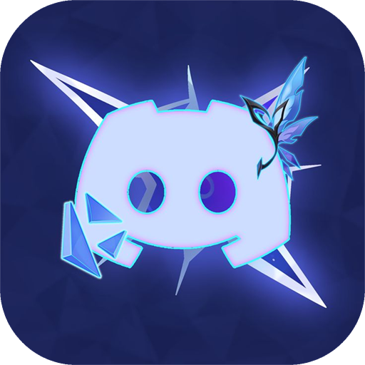

<div align="center">

<h1>Auto Quest Complete Discord</h1>

<p align="center">
  
</p>

<p><strong>🎮 Automate your Discord Quests with one click</strong></p>

<p>Complete Discord video, stream, activity, and game quests from one desktop app — up to five at a time, in the background, without downloading the games.</p>

<p>⭐ <strong>If you find this helpful, please give it a star!</strong> ⭐</p>

[](LICENSE)
[](https://github.com/ninokiru/Auto-Quest-Complete-Discord/releases)
[](https://tauri.app/)
[](https://vuejs.org/)
[](https://www.rust-lang.org/)
[](https://github.com/ninokiru/Auto-Quest-Complete-Discord/releases/latest)

</div>

---

Auto Quest Complete Discord is a desktop client for Discord's Quests page. It signs in with your
own Discord account, lists the quests available to that account, runs the ones you pick, and tells
you when a reward can be claimed. It is a free, open-source, GPL-3.0-only tool — no subscription, no
server of its own, and no telemetry.

> [!WARNING]
> **This tool is for educational purposes only.** Automating quests is not what Discord's Quests page
> is designed for, and using this tool may violate Discord's Terms of Service. Consequences can
> include the quest feature being disabled on the account, or the account itself being disabled. The
> authors are not responsible for any of that. Technically, the app does two things a security scanner
> will notice: it reads the login token stored by the local Discord client, and it rewrites its own
> process identity so Discord's client detection accepts a simulated game. If you want to limit the
> blast radius, run it on an account you do not depend on.

### Table of contents

- [📸 Screenshots](#-screenshots)
- [✨ Features](#-features)
- [🧭 What the app actually does](#-what-the-app-actually-does)
- [💻 Supported platforms and requirements](#-supported-platforms-and-requirements)
- [🚀 Download and install](#-download-and-install)
- [🎬 First run](#-first-run)
- [⚙️ Settings reference](#-settings-reference)
- [📐 Behaviour worth knowing](#-behaviour-worth-knowing)
- [🏗️ Architecture](#-architecture)
- [🔒 Security and privacy](#-security-and-privacy)
- [🩺 Troubleshooting](#-troubleshooting)
- [🛠️ Development](#-development)
- [🤝 Contributing](#-contributing)
- [📄 License](#-license)
- [🙏 Credits](#-credits)

## 📸 Screenshots

| Login | Home |
|:-----:|:----:|
|  |  |

| Multi-Account | Game Simulator |
|:-------------:|:--------------:|
|  |  |

| Quest Progress | Settings |
|:--------------:|:--------:|
|  |  |

> [!NOTE]
> These captures show the previous color scheme; the interface now uses a white and blue palette with a
> dark variant, so the layout is current but the colors are not.

## ✨ Features

### Signing in and accounts

| | |
| --- | --- |
| ⚡ **Three login methods** | Auto-detect accounts from supported local Discord profiles, connect through CDP to a running client, or paste a token manually when the other two are unavailable. |
| 🖥️ **Discord and Vesktop** | Pick which desktop client and which installation is used for CDP login, including custom or portable paths. Discord Stable, PT, Canary, and Vesktop are all handled. |
| 👥 **Multi-account** | Keep several Discord accounts in one app, switch between them, and keep separate quest history per account. |
| 🔑 **Token stays local** | The token is held in memory by the helper process; extraction uses the platform's own credential protection. |

### Quest automation

| | |
| --- | --- |
| 📺 **Video and stream quests** | Start once and let progress submissions run in the background. Configurable submission interval and completion speed. |
| 🎮 **Zero-download game quests** | Simulate a game process so Play/Install quests complete without downloading or installing the real game. A CDP injection mode covers games the simulator cannot handle. |
| 🎯 **Activity quests** | Drive Discord's own Activity page through CDP: navigate to the quest, launch the Activity, then take over progress reporting. |
| 🔀 **Five quests in parallel** | Run up to five quests at the same time from a queue, and stop any single one of them without touching the rest. |
| 🔍 **Batch actions** | Accept All, Complete All Video Quests, Complete All Game Quests, Complete All Quests, and Stop Queue. |
| 🗂️ **Filters and views** | Preset views (Recommended, To Accept, Ready to Run, Ready to Claim, Completed, All), free-text search, and filters by type, reward, status, and expiry. Filter state is saved between sessions. |
| 💎 **Reward context** | Current Orbs balance and a countdown to the next monthly Nitro Orbs claim, plus reward details per quest. |

### Running in the background

| | |
| --- | --- |
| 🌙 **Keep-awake** | While at least one quest is running, the app asks the OS not to sleep, and releases the request as soon as nothing is running. Windows and macOS. |
| 🔔 **Completion notifications** | An OS notification when a quest finishes or fails, worded in the language the app is currently showing. |
| 🚦 **Rate-limit aware requests** | Parallel quests share one release budget per API route, and a 429 holds the whole route instead of every slot collecting its own. |
| ⏳ **Enrollment cooldown surfaced** | When Discord temporarily blocks the account from accepting new quests, the dashboard says so and shows the deadline instead of failing every accept with an opaque error. |

### Interface and diagnostics

| | |
| --- | --- |
| 🌏 **16 languages** | English, Vietnamese, Simplified Chinese, Traditional Chinese, Japanese, Korean, Russian, Spanish, German, French, Indonesian, Polish, Brazilian Portuguese, European Portuguese, Thai, Turkish. The language follows your system setting on first run. |
| 🎨 **Light and dark themes** | A white and blue interface with a dark variant, switchable in Settings. |
| 🧪 **Debug view** | Live quest payload inspection, CDP state, runner build info, running-game detection snapshots, and token state for self-diagnosis. |
| 📤 **Sanitized log export** | One click exports this session's logs with tokens and account data redacted. |
| 🔄 **Update check** | The app compares its version against the latest GitHub release and shows a banner with a link when a newer build exists. |

## 🧭 What the app actually does

Discord's Quests page offers three kinds of task, and each one is completed differently. Claiming the
reward is a separate step, so it is listed too:

| Quest type | How this app completes it | Discord side effects you will see |
| --- | --- | --- |
| **Watch a video / stream** | Enroll, then submit quest progress on a timer until the required duration is reached. The default submission interval is 15 s and the default speed is 1x. | Your status can show the activity while it runs. |
| **Play a game (install-and-play)** | *Simulate mode*: launch a game process Discord recognises, so no download is needed. *CDP mode*: inject the playing state directly into the Discord client, which works for titles the simulator cannot produce. | The game appears in your activity, the same as if you had played it. |
| **Launch an Activity** | Navigate the Discord client to the quest page over CDP, you launch the Activity once, then the app keeps the session reporting progress. | Discord opens the Activity window. |
| **Claim the reward** | The app detects `completed_at` and exposes **Claim Reward**. Rewards that need a browser flow redirect the Discord client to the quest page and ask you to finish there. | Normal claim flow in Discord. |

A quest always follows the same lifecycle: **available → enrolled → in progress → completed → claimed**.
The app never marks a quest as claimed until Discord's own API agrees, and expired quests are hidden
by default (they can be shown for inspection).

## 💻 Supported platforms and requirements

Release binaries are built by GitHub Actions from the tagged commit, and the build log is public, so
every artifact can be traced back to this source tree.

| Platform | Architecture | Published now | Artifacts | Practical floor |
| --- | --- | --- | --- | --- |
| **Windows** | x64 | ✅ | NSIS installer `-setup.exe`, portable `-portable.zip` | Windows 10 or 11. Needs the Evergreen WebView2 runtime (already present on current Windows 10/11 builds). |
| **macOS** | Apple Silicon (arm64) | ⏳ build from source | `.dmg`, portable `.zip` | macOS 11 or newer. No Intel build. |
| **Linux** | x86_64 | ⏳ build from source | `.deb`, `.AppImage` | A glibc 2.35+ distribution with WebKitGTK 4.1: Ubuntu 22.04+, Debian 12+, Fedora 36+, Arch. X11 and Wayland are both supported. |

> [!IMPORTANT]
> **Release publishing is Windows-only for now**, to keep one release run to a single runner: the Apple
> Silicon bundle is the slowest job and the Linux job adds four headless GUI smoke tests. macOS and
> Linux are not deprecated — the source tree, the workspace crates, and the platform code are unchanged,
> CI still compiles and tests on all three, and only the release workflow's matrix is trimmed (look for
> the `TEMP` comments in `.github/workflows/build-release.yml`). Until those builds come back, produce
> them locally with [`pnpm tauri:build`](#-development).

Also required:

- **A Discord desktop client on the same machine.** CDP login, game quests in CDP mode, and Activity
  quests all attach to the local client; Vesktop is supported over CDP but is not scanned as a token
  source.
- **No ARM64 builds** for Windows or Linux, and **no Android or iOS builds**: the app attaches to the
  desktop client over Chrome DevTools Protocol, which the mobile apps do not expose.
- **Unsigned binaries.** Code-signing certificates cost money and this project stays free — see
  [SmartScreen and Defender](#smartscreen-and-defender).

## 🚀 Download and install

Get the latest build from [GitHub Releases](https://github.com/ninokiru/Auto-Quest-Complete-Discord/releases/latest).

### Windows

| File | How to use it |
| --- | --- |
| `auto-quest-complete-discord-Windows-x64-<version>-setup.exe` | Run the NSIS installer. |
| `auto-quest-complete-discord-Windows-x64-<version>-portable.zip` | Extract and run `auto-quest-complete-discord.exe`. **Keep `waybridge.exe` in the same folder** — it is the CDP launcher sidecar, and the app cannot start Discord with a debug port without it. |

#### SmartScreen and Defender

An unsigned binary that reads locally stored credentials and rewrites its own process identity looks
exactly like malware to heuristic scanners, so Defender may quarantine the download and SmartScreen
may show "Windows protected your PC". That is a false positive, not a detected infection.

1. Confirm the file came from this repository's Releases page.
2. On the SmartScreen dialog choose **More info → Run anyway**.
3. If Defender removed the file, restore it from quarantine and add its folder to
   **Virus & threat protection → Exclusions** before launching again.

On VirusTotal you will typically see 1-3 of 70 engines report a name like `Generic ML PUA` or
`Malicious`. `PUA` means "potentially unwanted application", not a virus, and those verdicts come from
machine-learning engines rather than a matched signature. The engines that ship signature databases
stay silent on the same file. If a build you downloaded shows a much higher count, do not run it and
open an issue instead.

### macOS and Linux

No `.dmg`, `.deb`, or `.AppImage` is attached to releases right now — see the note in
[Supported platforms and requirements](#-supported-platforms-and-requirements). The platform itself is
fully supported by the code, so build the artifact you need on that machine:

```bash
pnpm install
pnpm tauri:build   # macOS: .dmg + portable .zip · Linux: .deb + .AppImage
```

Bundles land in `target/release/bundle/`. Platform notes that still apply to your own build:

- **macOS** — an unsigned bundle gets quarantined by Gatekeeper. After moving the app to Applications:

  ```bash
  xattr -cr "/Applications/Auto Quest Complete Discord.app"
  ```

- **Linux** — AppImages need FUSE 2 (`libfuse2`) on distributions that ship FUSE 3 only; if one exits
  with `dlopen(): error loading libfuse.so.2`, install that package or use the `.deb`:

  ```bash
  sudo apt install ./auto-quest-complete-discord-Linux-x86_64-<version>.deb
  ```

- Convenience scripts: [build-macos.sh](build-macos.sh), [build-ubuntu.sh](build-ubuntu.sh).

> [!NOTE]
> Published binaries are built by GitHub Actions from the repository source. Linux packages target
> x86_64; macOS builds target Apple Silicon only.

## 🎬 First run

### 1. Sign in

1. **Auto Detect Token** — find accounts from supported local Discord profiles.
2. **CDP Login** — connect to the official Discord desktop client or Vesktop.
3. **Manual Input** — enter a token directly when the other methods are unavailable.

> [!TIP]
> Vesktop is supported through CDP only; it is not scanned as a local token source. You can select a
> detected installation or add a custom/portable `vesktop.exe` in **Settings → Discord Integration**.

### 2. Load the quest list

The dashboard fetches the quests available to the signed-in account. If Discord has put the account on
an enrollment cooldown, a red banner states the deadline; quests already running are unaffected.

### 3. Run quests

- **Video / Stream:** click **Start Quest** on an incomplete quest.
- **Game:** open **Game Simulator**, select a game, then create and run a simulated game — or switch
  to CDP injection in **Settings → Quest Behavior** if the title has no compatible executable.
- **Activity:** click **Launch Activity**, follow the four-step prompt in Discord, then start the
  quest from the app.
- **Batch:** use **Batch actions** to accept or start everything at once. Five slots run at a time and
  the rest wait in the queue.

Quests keep running when the window is hidden. Nothing needs to be clicked to finish a quest.

## ⚙️ Settings reference

| Section | What it controls |
| --- | --- |
| **Account** | Signed-in account, login method, manual token entry, token storage note. |
| **Quest Behavior** | Video completion speed (0.1x–2.0x, default 1.0x), video progress submission interval (10–30 s, default 15 s), game progress polling interval (30–300 s, default 120 s), game quest mode (Simulate or CDP injection), simulation directory, Orb/Nitro display toggle. |
| **Discord Integration** | Client and installation picker (Discord Stable/PT/Canary, Vesktop, custom path), CDP connection state, launch or restart the client with the debug port, sync client info over CDP. |
| **Appearance** | Light/dark theme and language. |
| **Diagnostics** | Export this session's sanitized logs for troubleshooting. |
| **Advanced** | CDP debug port (default 9223, custom port supported), developer mode, and legacy recovery options. |
| **About** | Version, license, and what the app does. |

**Settings → Overview** shows the current state of the account, client integration, and version, and
points at anything that needs attention.

## 📐 Behaviour worth knowing

### Parallelism and rate limits

Discord counts requests per route and per token, not per task, so five parallel slots look like one
very fast client. The REST client therefore paces itself:

- Requests on the same route are released one at a time with a **600 ms gap**. Snowflake ids in a path
  are normalized, so all five heartbeats on `/quests/<id>/heartbeat` share one queue.
- `x-ratelimit-bucket`, `x-ratelimit-remaining`, and `x-ratelimit-reset-after` are read: when a
  bucket's budget is spent, every route that shares that bucket waits until the reset.
- A **429 holds the whole route** for `retry_after` seconds (capped at 60 s) instead of each slot
  collecting its own 429 and sleeping separately.
- Accepted trade-off: batch actions are about 0.6 s slower per quest than an unpaced client. That is
  deliberate — it is what keeps one 429 from stopping the entire set.

### Enrollment cooldown

`/quests/@me` carries a timestamp for when the account may accept new quests again. When it is in the
future, Home shows the deadline and clears the banner on its own once the cooldown passes — no refetch
needed.

### Background behaviour

- Keep-awake is held automatically while any quest runs and released when none do. **Windows** uses
  `SetThreadExecutionState`, **macOS** uses `caffeinate` tied to the app's own pid so it dies with the
  app. Linux intentionally does nothing: configure your compositor's idle inhibition, or the machine
  may sleep mid-quest.
- Completion and failure notifications are raised through the OS (shell notification area on Windows,
  the stock notifier elsewhere). There is no toggle for this yet.

### Runtime identity

The release ships the CDP launcher sidecar under a neutral name (`waybridge`) and the app adjusts its
own process identity for game detection. This exists so Discord's client recognizes a simulated game
the same way it recognizes a real one; it is also the main reason antivirus heuristics flag the build.
The rationale and the surrounding machinery are documented in
[docs/desktop-client-provider-migration.md](docs/desktop-client-provider-migration.md),
[docs/discord-cdp-launch-core-migration.md](docs/discord-cdp-launch-core-migration.md), and
[docs/cdp-runtime-validation.md](docs/cdp-runtime-validation.md). CI audits every packaged binary
against the schema in [docs/runtime-identity-audit.schema.json](docs/runtime-identity-audit.schema.json)
and publishes the result next to the release artifacts.

### Scope: what this app does not touch

Quest automation only. By design there is no code for: store purchases, billing or payment sources,
`virtual-currency` redemption, ad-context fields, experiment flags, bulk guild joining, or
`X-Fingerprint` / `X-Installation-ID` request headers. If a future feature needs any of that, it is
out of scope rather than a TODO.

## 🏗️ Architecture

```text
Auto Quest Complete Discord
├─ Vue 3 + Vite frontend
│  ├─ Views: Home, Game Simulator, Settings, Debug
│  ├─ Pinia stores and composables for auth, quests, settings, and UI state
│  └─ src/api/tauri.ts — typed Tauri IPC client
│
├─ Tauri 2 Rust application
│  ├─ Discord API and Gateway integration
│  ├─ Per-route request pacing and 429 backoff
│  ├─ CDP client and quest execution for video, stream, activity, and game quests
│  ├─ Official Discord and Vesktop providers for discovery, launch, and process supervision
│  ├─ Token extraction and platform capability detection
│  ├─ Game simulation and manual CDP game sessions
│  ├─ Keep-awake and OS notification bridges
│  └─ Runtime identity auditing and platform runtime bridge management
│
├─ Workspace crates
│  ├─ discord-cdp-launch-core — cross-platform client discovery and launch core
│  ├─ src-cdp-launcher — optional Discord/Vesktop CDP launcher sidecar (ships as `waybridge`)
│  └─ src-runner — minimal game-process runner sidecar
│
└─ Discord services
   ├─ REST API — quests, accounts, rewards, and profile data
   ├─ Gateway — account and activity events
   └─ Discord/Vesktop CDP targets — browser automation and session capture
```

The frontend communicates with the Rust backend through Tauri IPC. The backend owns Discord networking,
local credential extraction, CDP sessions, quest execution, process cleanup, and platform-specific
integration. No part of the app talks to a server other than Discord's API and, for the update check,
GitHub's release API.

Explore the codebase with [](https://deepwiki.com/ninokiru/Auto-Quest-Complete-Discord)

## 🔒 Security and privacy

- **Tokens are kept in memory by the helper** — the app does not intentionally persist your Discord
  token to disk.
- **Platform-native credential protection** — auto-detection reads supported Discord profiles through
  Windows DPAPI, macOS Keychain, or Linux Secret Service.
- **HTTPS only for Discord traffic** — all API requests use secure HTTPS.
- **Sanitized diagnostics** — logs and debug exports redact tokens and account data where applicable,
  and log export covers the current session only.
- **No telemetry, no analytics, no accounts of ours** — there is no backend service, no usage
  reporting, and no sign-in other than Discord's.
- **Local network surface** — CDP connects to a loopback debug port on your own machine (default
  9223). Anything else on that machine could connect to the same port while it is open, so start the
  client with CDP only when you need it.

Report vulnerabilities privately — see [SECURITY.md](SECURITY.md). Only the latest release receives
security fixes.

## 🩺 Troubleshooting

| Symptom | Cause and fix |
| --- | --- |
| SmartScreen or Defender blocks the download | Unsigned binary. Follow the [Windows steps](#windows) — restore from quarantine and add an exclusion. |
| macOS says the app is damaged or cannot be opened | Quarantine flag on an unsigned build: `xattr -cr "/Applications/Auto Quest Complete Discord.app"`. |
| Auto-detect finds no account | Discord is installed in a non-standard location, or the profile is not a supported channel. Use CDP login or manual token entry. |
| "CDP not available. Start Discord with debug port." | Discord was launched normally, without `--remote-debugging-port`. Use **Settings → Discord Integration → Launch/Restart Discord with CDP**, and approve the restart prompt. |
| CDP connects but quests do not progress | Confirm the right client and installation are selected, then re-sync client info from the same panel. The Debug view shows the live CDP state. |
| A game quest refuses to simulate | Some titles ship a Windows-only executable, which cannot be process-simulated on Linux; others have no known executable. Switch to CDP injection mode and retry. |
| Game never detected while simulating | Discord has not indexed the game. Check **Settings → Quest Behavior → simulation directory**, then see [docs/cdp-runtime-validation.md](docs/cdp-runtime-validation.md) for what the discovery attempts mean. |
| AppImage will not start (`libfuse.so.2`) | Install `libfuse2`, or use the `.deb`. |
| Blank window on Linux, especially in a VM | WebKitGTK's accelerated compositor renders nothing on some drivers. The app already falls back to software compositing for known cases; if it still happens, launch with `WEBKIT_DISABLE_COMPOSITING_MODE=1`. |
| Every accept fails with an unclear error, or a red banner appears | Discord has the account on an enrollment cooldown. The banner names the deadline; wait it out. Running quests are unaffected. |
| Quests stopped when the machine slept | Keep-awake covers Windows and macOS only. On Linux, enable idle inhibition in your compositor. |
| Five parallel quests feel slow | Expected: requests are paced per route to avoid 429 storms. Lower the parallelism or the submission interval if you want fewer, slower requests. |

## 🛠️ Development

### Requirements

- **Node.js** 18 or newer and **pnpm** (the repository pins `pnpm@11.18.0` via `packageManager`).
- **Rust** stable toolchain.
- **Windows**: Visual Studio Build Tools with the C++ workload. **macOS**: Xcode Command Line Tools.
  **Linux**: the Tauri 2 prerequisites, including `libwebkit2gtk-4.1-dev`.

```bash
git clone https://github.com/ninokiru/Auto-Quest-Complete-Discord.git
cd Auto-Quest-Complete-Discord
pnpm install
pnpm tauri:dev
```

### Commands

| Command | Description |
| --- | --- |
| `pnpm tauri:dev` | Development mode with hot reload; syncs the version and builds both sidecars first. |
| `pnpm tauri:build` | Production build (same sidecar and version steps). Output: `target/release/bundle/`. |
| `pnpm dev` / `pnpm build` | Frontend only — Vite dev server on `:1420`, and `vue-tsc` + production bundle. |
| `pnpm test` | Frontend unit tests (Vitest). |
| `pnpm i18n:check` | Validate all 16 locale files for missing or extra keys. |
| `pnpm sync-version` | Propagate `public/version.txt` into the app, Tauri, and Cargo configs. |
| `pnpm build:runner` / `pnpm build:cdp-launcher` | Build one sidecar. |
| `pnpm check:runtime-identity`, `pnpm test:identity-audit`, `pnpm test:packaged-identity` | Identity config and packaged-binary audits. |
| `pnpm analyze:har` | Derive quest schema facts from a HAR capture (Python). |
| `cargo fmt --package discord-cdp-launch-core --package discord-cdp-launcher` | Formatting for the shared crates. |
| `cargo fmt --manifest-path src-tauri/Cargo.toml` | Formatting for the Tauri backend. |
| `cargo clippy --workspace --all-targets --all-features -- -D unused -D clippy::correctness -D clippy::suspicious` | Rust lint gate, exactly as CI runs it. `unused`, correctness, and suspicious are hard errors; the style group stays warning-level because of a known backlog. |
| `cargo test --workspace --no-fail-fast -- --test-threads=1` | Rust test gate. Single-threaded on purpose: several tests mutate process env or need a free loopback port. |

Release builds add `--locked` to the Cargo invocation, so no dependency can move without a
regenerated `Cargo.lock`.

### What CI enforces

| Workflow | Triggers | Runs |
| --- | --- | --- |
| **Verify** | Every push to `main`, plus manual dispatch | One Linux runner, no bundling: version sync, `pnpm i18n:check`, `pnpm test`, `pnpm build` (which is the `vue-tsc` type gate), the runtime-identity policy and audit-tool checks, `cargo fmt --check` over the three formatted crates, the clippy gate above, `cargo test`, and the CDP-core dependency boundary check. Fails in minutes with the exact rustfmt/clippy output. |
| **CI** | Pull requests to `main` and `develop`, pushes to `develop` | The same gates across the three-platform matrix (Windows, macOS arm64, Ubuntu 22.04). |
| **build-release** | Pushes that change `public/version.txt`, plus manual dispatch | Builds and publishes the Windows `.exe` and portable `.zip`, audits the packaged identity, and creates the draft release. The macOS and Linux jobs exist in this workflow but are commented out with `TEMP` markers while publishing stays single-runner; the Linux `.deb`/`.AppImage` audit and X11/Wayland smoke tests reactivate with them. |

The Rust, TypeScript, and i18n gates are blocking. The Linux GUI smoke reports a warning rather than
failing a release, because a headless compositor test is the least reliable check in CI.

Per-platform helper scripts for local builds: [build-windows.ps1](build-windows.ps1),
[build-macos.sh](build-macos.sh), [build-ubuntu.sh](build-ubuntu.sh).

## 🤝 Contributing

Contributions are welcome. See [CONTRIBUTING.md](CONTRIBUTING.md) for development setup, project
structure, code conventions, and the pull request checklist, and
[CODE_OF_CONDUCT.md](CODE_OF_CONDUCT.md) for expected conduct. Issues are the right place for bug
reports — include the exported sanitized logs and the platform you are on.

## 📄 License

GNU General Public License v3.0 only — see [LICENSE](LICENSE).

In practice this means you are free to use, study, change, and redistribute this app, but **any
derivative you distribute must stay under GPL-3.0 with its complete source code available**, and must
carry the same notice that it comes without warranty. Building your own private copy for yourself has
no such obligation. Contributions to this repository are licensed under GPL-3.0-only as well.

## 🙏 Credits

**Forked from**

- `discord-quest-helper` by Masterain (MIT licensed) — this repository is a renamed continuation of
  that project, maintained as **Lumina** under `ninokiru/Auto-Quest-Complete-Discord`, starting again
  at `0.0.1`. Upstream authorship of the original project remains credited to Masterain. MIT permits
  the code it covers to be redistributed under a copyleft license, so this fork is released under
  GPL-3.0-only; the original MIT notice stays published in that project's own repository.

**Inspiration and resources**

- [markterence/discord-quest-completer](https://github.com/markterence/discord-quest-completer)
- [power0matin/discord-quest-auto-completer](https://github.com/power0matin/discord-quest-auto-completer)
- [taisrisk/Discord-Quest-Helper](https://github.com/taisrisk/Discord-Quest-Helper)
- [aamiaa/CompleteDiscordQuest.md](https://gist.github.com/aamiaa/204cd9d42013ded9faf646fae7f89fbb)
- [docs.discord.food](https://docs.discord.food/) — reference for the undocumented user-API quest endpoints

**Technologies**

- [Tauri](https://tauri.app/) • [Vue.js](https://vuejs.org/) • [Pinia](https://pinia.vuejs.org/) • [vue-i18n](https://vue-i18n.intlify.dev/) • [shadcn-vue](https://www.shadcn-vue.com/) • [TailwindCSS](https://tailwindcss.com/) • [Lucide Icons](https://lucide.dev/)

## ℹ️ Disclaimer

Discord, the Discord logo, and Discord Quests are trademarks of Discord Inc. This project is not
affiliated with, endorsed by, or sponsored by Discord Inc. It exists to automate a feature through the
same endpoints the desktop client uses; that is also why it may stop working at any time, and why
using it carries account risk. Use it on your own account, at your own risk.
